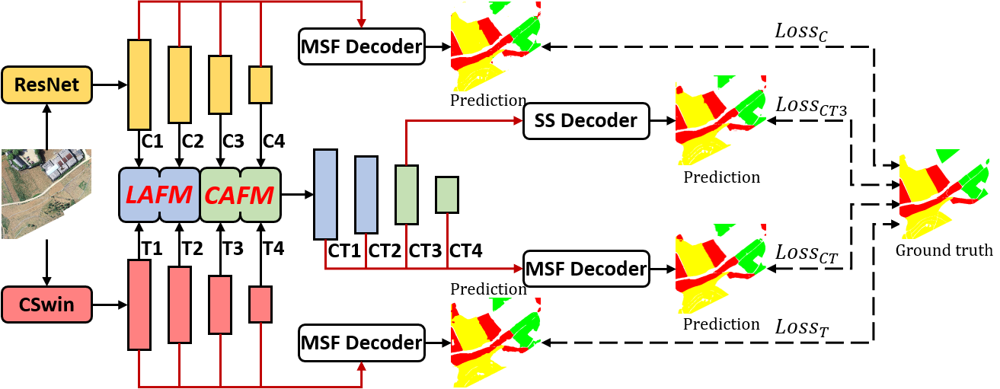

# CCTNet: Coupled CNN and Transformer Network for Crop Segmentation of Remote Sensing Images, [RemoteSensing](https://www.mdpi.com/2072-4292/14/9/1956/htm)
## Introduction 
We propose a Coupled CNN and Transformer Network to combine the local modeling advantage of the CNN and the global modeling advantage of Transformer to achieve SOTA performance on the [Barley Remote Sensing Dataset](https://tianchi.aliyun.com/dataset/dataDetail?spm=5176.12281978.0.0.76944054ZQD0l2&dataId=74952). By applying our code base, you can easily deal with ultra-high-resolution remote sensing images. If our work is helpful to you, please star us.  

<br/>
## Usage
* Install packages  

  This repository is based on `python 3.6.12` and `torch 1.6.0`.  
  
  ```
  git clone https://github.com/zyxu1996/CCTNet.git
  cd CCTNet  
  ```
  ```
  pip install -r requirements.txt
  ```
* Prepare datasets and pretrained weights  

  * The code base has supported three high-resolution datasets, are respective Barley, Potsdam and Vaihingen.
  * Download `Barley, Potsdam and Vaihingen` datasets form BaiduYun, and put them on `./data `   
    `BaiduYun`: [https://pan.baidu.com/s/1MyDw1qncPKYJFK_zjFxFBA](https://pan.baidu.com/s/1MyDw1qncPKYJFK_zjFxFBA)  
    `Password`: s7f2 
    
    Data file structure of the above three datasets is as followed.  
    ```
    ├── data                    ├── data                      ├── data
        ├──barley                   ├──potsdam                    ├──vaihingen
           ├──images                   ├──images                     ├──images
              ├──image_1_0_0.png          ├──top_potsdam_2_10.tif       ├──top_mosaic_09cm_area1.tif
              ├──image_1_0_1.png          ├──top_potsdam_2_11.tif       ├──top_mosaic_09cm_area2.tif
                 ...                         ...                           ...
           ├──labels                   ├──labels                     ├──labels
              ├──image_1_0_0.png          ├──top_potsdam_2_10.png       ├──top_mosaic_09cm_area1.png
              ├──image_1_0_1.png          ├──top_potsdam_2_11.png       ├──top_mosaic_09cm_area2.png
                 ...                         ...                           ...
           ├──annotations              ├──annotations                ├──annotations
              ├──train.txt                ├──train.txt                  ├──train.txt
              ├──test.txt                 ├──test.txt                   ├──test.txt

    ```
  
  * Download the pretained weights from [CSwin-Transformer](https://github.com/microsoft/CSWin-Transformer), and put them on `./pretrained_weights`    
    CSwin: `CSwin Tiny, Small, Base and Large` pretrained on `ImageNet-1K` and `ImageNet-22K` are used.  
    ResNet: `ResNet 18, 34, 50 and 101` pretrained models are used, the download link is contained in the our code.  
    
* Training

  * The training and testing settings are written in the script, including the selection of datasets and models.    
    ```
    sh autorun.sh
    ```
  * If directly run train.py, please undo the following code.
    ```
    if __name__ == '__main__':
      os.environ["CUDA_VISIBLE_DEVICES"] = "0,1,2,3"
      os.environ.setdefault('RANK', '0')
      os.environ.setdefault('WORLD_SIZE', '1')
      os.environ.setdefault('MASTER_ADDR', '127.0.0.1')
      os.environ.setdefault('MASTER_PORT', '29556')
    ```
* Testing
  * Generating the final results and visulizing the prediction.   
    ```
    cd ./work_dir/your_work
    ```
  * Do remember undo the test command in `sh autorun.sh`. And keep the `--information num1` in testing command is same as the information in training command.   
    `CUDA_VISIBLE_DEVICES=0 python -m torch.distributed.launch --nproc_per_node=1 --master_port 29505 test.py --dataset barley --val_batchsize 8 --models cctnet --head seghead --crop_size 512 512 --trans_cnn cswin_tiny resnet50 --save_dir work_dir --base_dir ../../ --information num1
` 
  * Then run the script autorun.sh.  
    ```
    sh autorun.sh
    ```
## Acknowledgments
Thanks Guangzhou Jingwei Information Technology Co., Ltd., and the Xingren City government for providing the Barley Remote Sensing Dataset.
Thanks the ISPRS for providing the Potsdam and Vaihingen datasets.
## Citation
```
Waiting for Update.
```
## Other Links
* [HRCNet: High-Resolution Context Extraction Network for Semantic Segmentation of Remote Sensing Images](https://github.com/zyxu1996/HRCNet-High-Resolution-Context-Extraction-Network)
* [Efficient Transformer for Remote Sensing Image Segmentation](https://github.com/zyxu1996/Efficient-Transformer)
